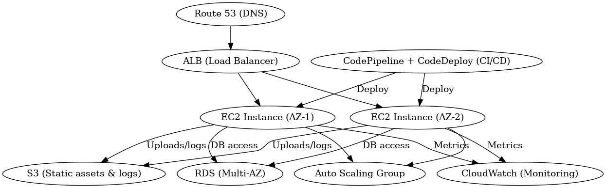

# aws-ha-webapp-terraform
# 🏗️ AWS Highly Available Web Application (Terraform)

This project sets up a **highly available and scalable web application infrastructure** on AWS using Terraform with best practices (modular architecture).

---

## 🧰 Technologies Used

- **Terraform**
- **AWS Services**:
  - VPC, EC2, ALB, Auto Scaling, RDS, S3, IAM, CloudWatch
- **CI/CD**: CodePipeline, CodeDeploy (planned extension)

---

## 📐 Architecture



### Components:
- **Route 53** – DNS Routing
- **Application Load Balancer** – Distributes traffic across EC2s
- **EC2 Instances** – Web servers deployed across 2 AZs
- **Auto Scaling Group** – Ensures high availability
- **RDS (Multi-AZ)** – Managed relational database
- **S3** – Stores static assets and logs
- **CloudWatch** – Logs and performance monitoring
- **IAM** – Secure access control
- **Terraform Modules** – Modular, reusable infrastructure code

---

## 📁 Project Structure
terraform_project/
│
├── main.tf
├── variables.tf
├── outputs.tf
├── modules/
│ ├── vpc/
│ ├── ec2/
│ ├── alb/
│ ├── autoscaling/
│ ├── rds/
│ ├── s3/
│ ├── iam/
│ └── cloudwatch/


---

## 🚀 How to Deploy

1. **Install Terraform**  
   [https://developer.hashicorp.com/terraform/downloads](https://developer.hashicorp.com/terraform/downloads)

2. **Initialize the project**  
   ```bash
   terraform init
3. Review the execution plan
   terraform plan
4. Apply the infrastructure
   terraform apply

🔐 Security Notes
Ensure your AWS credentials are managed securely (use IAM roles or secrets manager).

RDS password and other secrets should be stored using terraform.tfvars or tools like AWS Secrets Manager.

📌 To Do
Add CI/CD pipeline using CodePipeline & CodeDeploy

Add HTTPS via ACM + ALB

Implement full disaster recovery automation

📃 License
This project is open-source and available under the MIT License.


